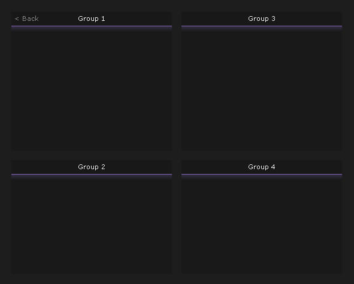

# 💻 gui


available examples: [gui interaction](../../other/examples/gui-interaction.md)


## functions:

### menu\_bool

`gui.menu_bool(name: string):` <mark style="color:purple;">`menu_element`</mark>

Returns an item from the menu that has been assigned the boolean data type.

### menu\_int

`gui.menu_int(name: string):` <mark style="color:purple;">`menu_element`</mark>

Returns an item from the menu that has been assigned the integer data type.

### menu\_float

`gui.menu_float(name: string):` <mark style="color:purple;">`menu_element`</mark>

Returns an item from the menu that has been assigned the float data type.

### menu\_color

`gui.menu_float(name: string):` <mark style="color:purple;">`menu_element`</mark>

Returns an item from the menu that has been assigned the color data type.

### get\_bind\_mode

`gui.get_bind_mode(name: string):` <mark style="color:purple;">`integer`</mark>

Returns the mode of the bind.

### get\_bind\_state

`gui.get_bind_state(name: string):` <mark style="color:purple;">`boolean`</mark>

Returns the state of the bind.

### set\_bind\_state

`gui.get_bind_state(name: string, state: boolean)`

Sets the value of the bind.

### begin



`gui.begin(group_name: array of strings):` <mark style="color:purple;">`gui_group`</mark> <mark style="color:purple;">`maximum: 4`</mark>

Creates a group with gui elements.

<figure><figcaption></figcaption></figure>


